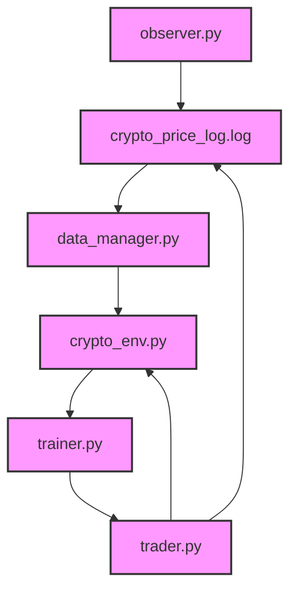
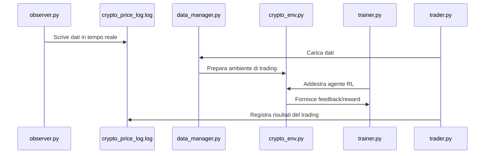
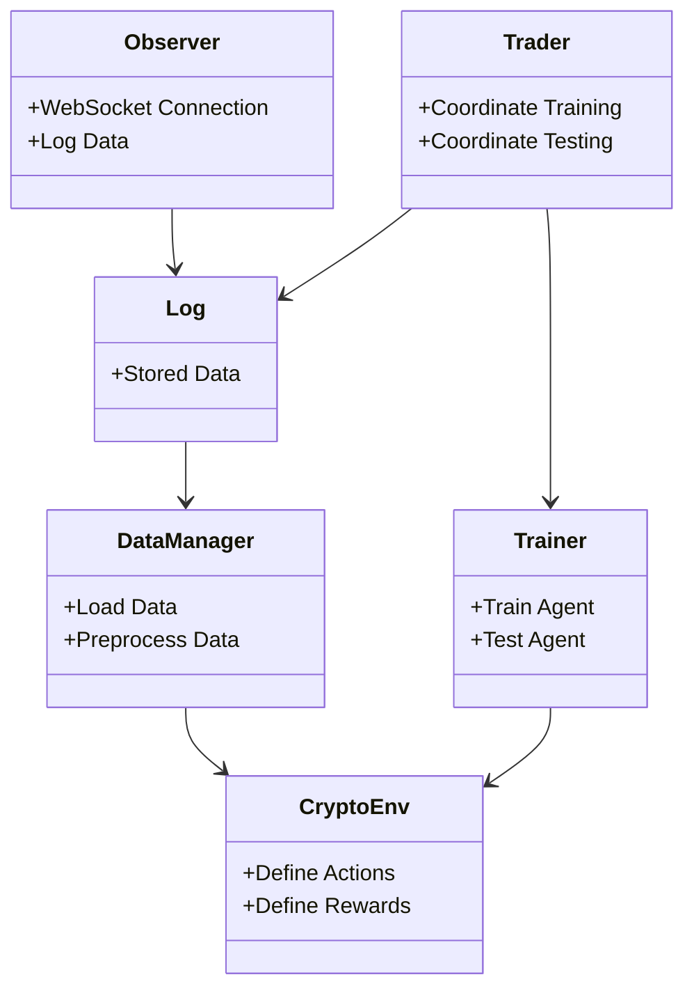

# 🚀 Sistema di Trading Algoritmico per Criptovalute

Questo progetto è un sistema di trading algoritmico basato su **Reinforcement Learning** (RL) progettato per analizzare e tradare criptovalute in tempo reale.

## 📝 **Descrizione del Sistema**

Il sistema è suddiviso in diversi componenti per garantire una chiara separazione delle responsabilità:

1. **observer.py**:  
   Si connette al WebSocket di Binance per ricevere dati in tempo reale e li registra in un file di log.

2. **data_manager.py**:  
   Carica e pre-processa i dati dal file di log generato.

3. **crypto_env.py**:  
   Definisce un ambiente personalizzato di trading utilizzato dall'agente di Reinforcement Learning.

4. **trainer.py**:  
   Contiene le funzioni per l'addestramento e il testing dell'agente.

5. **trader.py**:  
   Coordina l'addestramento e il testing continuo dell'agente di trading.

## 📂 **Struttura del Progetto**

```
project/
│-- observer.py
│-- data_manager.py
│-- crypto_env.py
│-- trainer.py
│-- trader.py
│-- log/
│   └── crypto_price_log.log
└-- requirements.txt
```

## 📊 **Diagrammi del Sistema**

### 1. **Panoramica del Sistema**



### 2. **Flusso dei Dati**



### 3. **Architettura del Sistema**



## 📖 **Documentazione Completa**

Per una descrizione dettagliata di ciascun componente e del funzionamento del sistema, consulta la [Documentazione Completa](project_documentation_corrected.md).

## 💻 **Requisiti di Sistema**

- **Python 3.10**
- **Librerie**:
  - `websocket-client`
  - `gymnasium`
  - `numpy`
  - `pandas`
  - `matplotlib`
  - `joblib`

## 🚀 **Installazione**

1. Clona il repository:

   ```bash
   git clone https://github.com/tuo-username/trading-algoritmico.git
   cd trading-algoritmico
   ```

2. Crea un ambiente virtuale e attivalo:

   ```bash
   python -m venv .venv
   source .venv/bin/activate  # Su Windows: .venv\Scripts\activate
   ```

3. Installa le dipendenze:

   ```bash
   pip install -r requirements.txt
   ```

## ▶️ **Esecuzione del Sistema**

1. **Avvia il `observer.py`** per raccogliere i dati:

   ```bash
   python observer.py
   ```

2. **Avvia il `trader.py`** per addestrare e testare l'agente:

   ```bash
   python trader.py
   ```

## 🤝 **Contributi**

I contributi sono benvenuti! Sentiti libero di aprire un **Pull Request** o segnalare un problema tramite **Issues**.

## 📜 **Licenza**

Questo progetto è rilasciato sotto la licenza **MIT**.
