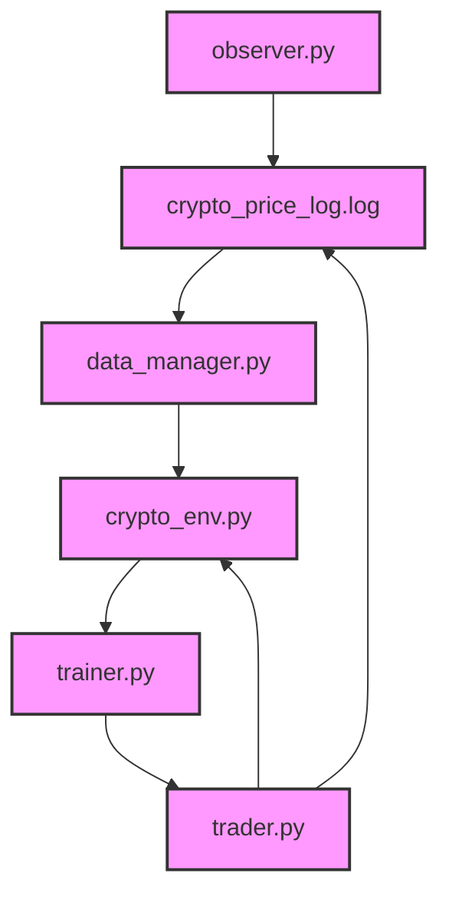
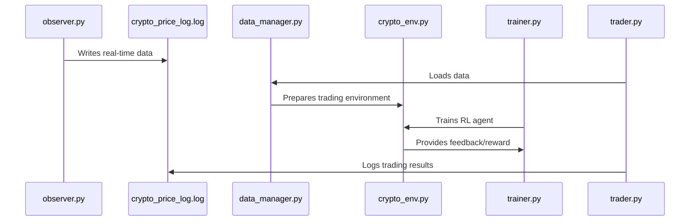

# 🚀 **Algorithmic Cryptocurrency Trading System**

This project is for simulating algorithmic trading based on [**Reinforcement Learning** (RL)](reinforcement_learning.md), designed to analyze and trade cryptocurrencies in real time.

## 📝 **System Description**

The system is divided into several components to ensure clear separation of responsibilities:

1. **observer.py**:  
   Connects to the Binance WebSocket to receive real-time data and logs it to a file.

2. **data_manager.py**:  
   Loads and preprocesses the data from the generated log file.

3. **crypto_env.py**:  
   Defines a custom trading environment used by the Reinforcement Learning agent.

4. **trainer.py**:  
   Contains functions for training and testing the agent.

5. **trader.py**:  
   Coordinates the continuous training and testing of the trading agent.

## 📂 **Project Structure**

```
project/
│-- observer.py
│-- data_manager.py
│-- crypto_env.py
│-- trainer.py
│-- trader.py
│-- log/
│   └── crypto_price_log.log
│-- requirements.txt
└── DISCLAIMER.md
```

## 📊 **System Diagrams**

### 1. **System Overview**



### 2. **Data Flow**



## 📖 **Full Documentation**

For a detailed description of each component and system functionality, refer to the [Full Documentation](project_documentation.md).

## ⚠️ **Disclaimer**

This system is developed for educational and learning purposes. **It does not perform real trading operations but simulates trading decisions.**

For more details, read the [Disclaimer](DISCLAIMER.md).

## 💻 **System Requirements**

- **Python 3.10**
- **Libraries**:
  - `websocket-client`
  - `gymnasium`
  - `numpy`
  - `pandas`
  - `matplotlib`
  - `joblib`

## 🚀 **Installation**

1. Clone the repository:

   ```bash
   git clone https://github.com/your-username/algorithmic-trading.git
   cd algorithmic-trading
   ```

2. Create and activate a virtual environment:

   ```bash
   python -m venv .venv
   source .venv/bin/activate  # On Windows: .venv\Scripts\activate
   ```

3. Install the dependencies:

   ```bash
   pip install -r requirements.txt
   ```

## ▶️ **Running the System**

1. **Start `observer.py`** to collect data:

   ```bash
   python observer.py
   ```

2. **Start `trader.py`** to train and test the agent:

   ```bash
   python trader.py
   ```

## 🤝 **Contributions**

Contributions are welcome! Feel free to open a **Pull Request** or submit an issue via **Issues**.

## 📜 **License**

This project is released under the [MIT License](LICENSE.md).

## 🌱 **Future Developments**

This project provides a solid foundation for exploring algorithmic trading with Reinforcement Learning, but there are many opportunities for improvements and new features.

To learn about potential system enhancements, refer to the [Future Work and Improvements](future_work.md) document.

🚀 **Keep exploring, experimenting, and innovating!** 🚀