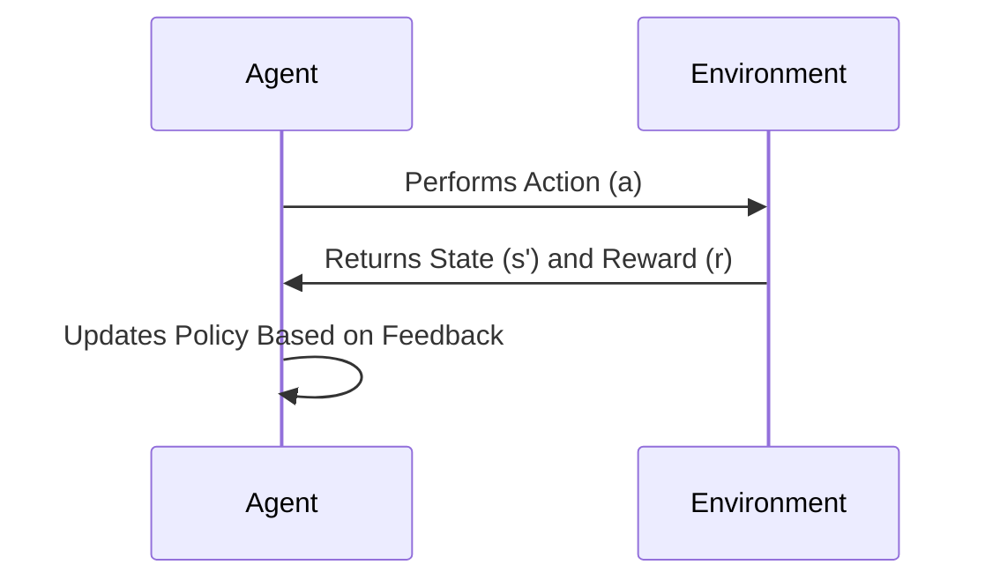

# 🤖 **Introduction to Reinforcement Learning**

**Reinforcement Learning** (RL) is a branch of **Machine Learning** that focuses on how an agent can learn to make optimal decisions by interacting with an environment.

---

## 📝 **What is Reinforcement Learning?**

In a Reinforcement Learning system, an agent learns to perform actions in an environment with the goal of **maximizing cumulative reward** over time. The agent explores the environment and receives feedback in the form of **rewards** or **penalties**.

### 🔹 **Key Components**

1. **Agent**:  
   The system that makes decisions (e.g., a robot, a trading software).

2. **Environment**:  
   The context in which the agent operates (e.g., a financial market).

3. **State**:  
   The current situation of the environment observable by the agent.

4. **Actions**:  
   The possible choices the agent can make.

5. **Reward**:  
   The feedback received by the agent after performing an action.

6. **Policy**:  
   The strategy used by the agent to select actions based on the current state.

7. **Value Function**:  
   An estimate of how advantageous it is to be in a given state or take a specific action.

8. **Model of the Environment (Optional)**:  
   A representation of the environment's dynamics, useful for simulation.

---

## 🔄 **Reinforcement Learning Cycle**

1. The agent observes the current state of the environment.
2. It selects an action based on its policy.
3. The agent receives a reward and observes the new state of the environment.
4. It updates the policy to maximize future rewards.

---

## 🧠 **Reinforcement Learning Algorithms**

### 🔹 **Basic Methods**

1. **Q-Learning**:  
   An off-policy algorithm that learns the action-value function \( Q(s, a) \).

2. **SARSA (State-Action-Reward-State-Action)**:  
   An on-policy algorithm that updates the policy based on the actions actually taken.

### 🔹 **Advanced Methods**

1. **Deep Q-Learning (DQN)**:  
   Uses neural networks to estimate the \( Q \) function for continuous and complex states.

2. **Policy Gradient Methods**:  
   Directly learn an optimal policy without estimating the value function.

3. **Actor-Critic Methods**:  
   Combine policy-based methods with value-based methods.

---

## 📈 **Applications of Reinforcement Learning**

- **Algorithmic Trading**: Automating trading decisions to maximize profit.
- **Robotics**: Controlling robots for complex tasks like walking or manipulating objects.
- **Gaming**: Creating agents that can play and win against human players.
- **System Control**: Optimizing industrial processes and complex systems.
- **Autonomous Vehicles**: Learning driving strategies for self-driving cars.

---

## 🌟 **Conclusion**

Reinforcement Learning is a powerful and versatile field that can be applied to a wide range of problems. Although it requires a significant amount of data and computation, its applications are revolutionizing numerous industries.

🚀 **Explore, experiment, and create intelligent agents!** 🚀