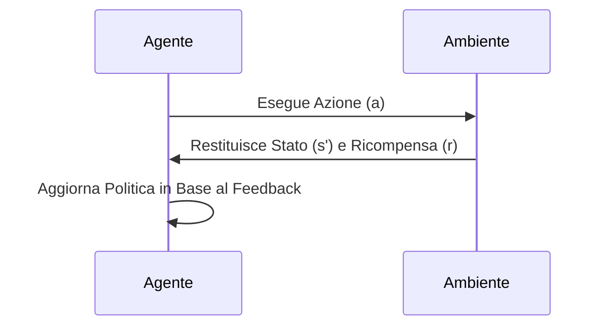

# 🤖 **Introduzione al Reinforcement Learning**

Il **Reinforcement Learning** (RL) è una branca dell'**apprendimento automatico** (Machine Learning) che si occupa di come un agente può imparare a prendere decisioni ottimali attraverso l'interazione con un ambiente.

---

## 📝 **Cos'è il Reinforcement Learning?**

In un sistema di Reinforcement Learning, un agente impara a compiere azioni in un ambiente con l'obiettivo di **massimizzare una ricompensa cumulativa** nel tempo. L'agente esplora l'ambiente e riceve feedback sotto forma di **reward** (ricompensa) o **penalty** (penalità).

### 🔹 **Componenti Principali**

1. **Agente**:  
   Il sistema che prende decisioni (es. un robot, un software di trading).

2. **Ambiente**:  
   Il contesto in cui l'agente opera (es. un mercato finanziario).

3. **Stato**:  
   La situazione attuale dell'ambiente osservabile dall'agente.

4. **Azioni**:  
   Le scelte possibili che l'agente può compiere.

5. **Ricompensa (Reward)**:  
   Il feedback ricevuto dall'agente dopo aver eseguito un'azione.

6. **Politica (Policy)**:  
   La strategia adottata dall'agente per scegliere le azioni in base allo stato corrente.

7. **Funzione Valore (Value Function)**:  
   Una stima di quanto sia vantaggioso trovarsi in un determinato stato o eseguire una determinata azione.

8. **Modello dell'Ambiente (facoltativo)**:  
   Una rappresentazione delle dinamiche dell'ambiente, utile per la simulazione.

---

## 🔄 **Ciclo di Apprendimento nel Reinforcement Learning**

1. L'agente osserva lo stato corrente dell'ambiente.
2. Sceglie un'azione in base alla politica.
3. Riceve una ricompensa e osserva il nuovo stato dell'ambiente.
4. Aggiorna la politica per massimizzare le ricompense future.

---

## 🧠 **Algoritmi di Reinforcement Learning**

### 🔹 **Metodi di Base**

1. **Q-Learning**:  
   Un algoritmo off-policy che cerca di apprendere la funzione del valore d'azione \( Q(s, a) \).

2. **SARSA (State-Action-Reward-State-Action)**:  
   Un algoritmo on-policy che aggiorna la politica in base alle azioni effettivamente intraprese.

### 🔹 **Metodi Avanzati**

1. **Deep Q-Learning (DQN)**:  
   Utilizza reti neurali per stimare la funzione \( Q \) per stati continui e complessi.

2. **Policy Gradient Methods**:  
   Apprendono direttamente una politica ottimale senza stimare la funzione del valore.

3. **Actor-Critic Methods**:  
   Combinano i metodi basati su policy con quelli basati su valore.

---

## 📈 **Applicazioni del Reinforcement Learning**

- **Trading Algoritmico**: Automatizzazione delle decisioni di trading per massimizzare il profitto.
- **Robotica**: Controllo di robot per compiti complessi come camminare o manipolare oggetti.
- **Gaming**: Creazione di agenti in grado di giocare e vincere contro giocatori umani.
- **Controllo di Sistemi**: Ottimizzazione di processi industriali e sistemi complessi.
- **Veicoli Autonomi**: Apprendimento di strategie di guida per auto a guida autonoma.

---

## 🌟 **Conclusione**

Il Reinforcement Learning è un campo potente e versatile che può essere applicato a una vasta gamma di problemi. Sebbene richieda una quantità significativa di dati e calcoli, le sue applicazioni stanno rivoluzionando numerosi settori.

🚀 **Esplora, sperimenta e crea agenti intelligenti!** 🚀
